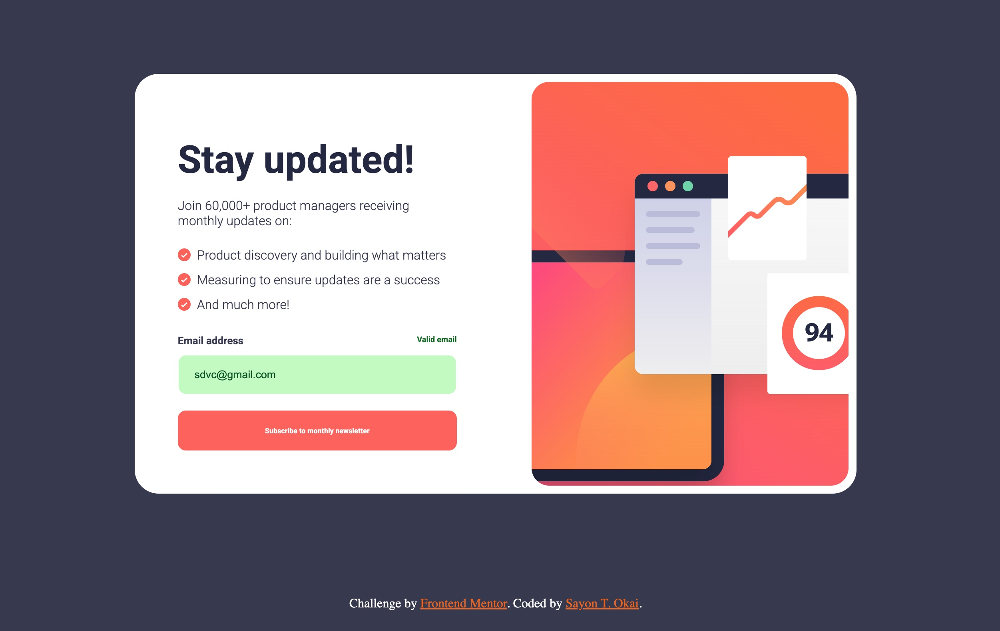

# Frontend Mentor - FAQ accordion solution

This is a solution to the [FAQ accordion challenge on Frontend Mentor](https://www.frontendmentor.io/challenges/faq-accordion-wyfFdeBwBz). Frontend Mentor challenges help you improve your coding skills by building realistic projects. 

## Table of contents

- [Overview](#overview)
  - [The challenge](#the-challenge)
  - [Screenshot](#screenshot)
- [My process](#my-process)
  - [Built with](#built-with)
  - [What I learned](#what-i-learned)
- [Author](#author)


**Note: Delete this note and update the table of contents based on what sections you keep.**

## Overview

### The challenge

Users should be able to:


- Add their email and submit the form
- See a success message with their email after successfully submitting the form
- See form validation messages if:
  - The field is left empty
  - The email address is not formatted correctly
- View the optimal layout for the interface depending on their device's screen size
- See hover and focus states for all interactive elements on the page

### Screenshot




### Links

- Solution URL: []
- Live Site URL: []

## My process

### Built with

- Semantic HTML5 markup
- CSS custom properties
- CSS Grid
- CSS Flexbox
- Mobile-first workflow
- Vanilla JS


### What I learned
Was able to enhance my computational thinking skills 


```js
// validate on keypress
document.addEventListener("input", function () {
    if (validateEmail(newsletterEmail.value)) {
        newsletterEmail.addEventListener("keypress", function () {
         
            if (validateEmail(newsletterEmail.value)) {
                     validationMessage.classList.add("valid-msg");
                     validationMessage.textContent = "Valid email";
                     validationMessage.classList.remove("error-msg");
            }
            
            else {
                     validationMessage.classList.remove("valid-msg");
                     validationMessage.textContent = "Invalid email";
                     validationMessage.classList.add("error-msg");
            }
        })
 
    } else if (newsletterEmail.value === "") {
            // Reload if input field is empty
         this.location.reload();
              
       
    } 
    
})

```

## Author

- Frontend Mentor - [Sayon-okai](https://www.frontendmentor.io/profile/Sayon-okai)
- GitHub - [Sayon-okai](https://github.com/Sayon-okai)


